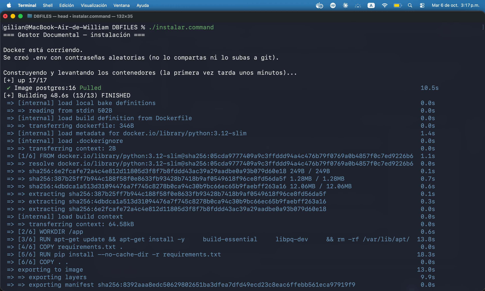
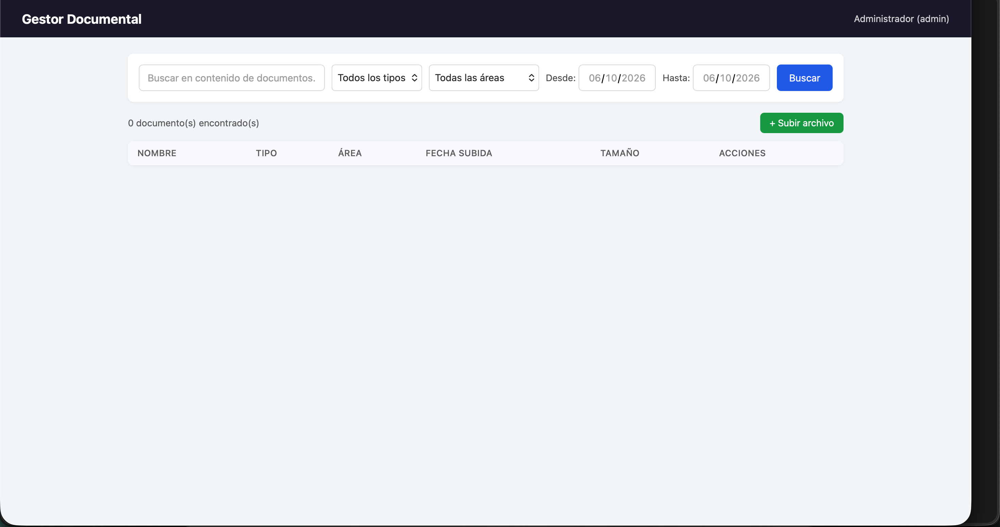

###  1: FOR MAC AS HOST: 

# First Time seutp: 

1. Run in terminal ./instalar.command inside the path of the repo: 

 Or double-clic the file "instalar.command" inside the folder 

 

2. Should have this as proof the host is running the service: 

 3.21.56 p.m..png>)

## FOR LOGIN IN SAME WIFI NETWORK DEVICES:

3. IN THE HOST: 
 Go to your internet web browser and find: 
 http://localhost:80

 

OR IN ANY DEVICE CONNECTED TO THE SAME WIFI NETWORK AS THE HOST: 

 Go to your internet web browser and find: 

 http://HOST_IP

 You can find your host ip inside the host terminal with 

 MacOS/linux: ifconfig 

 Windows: ipconfig 

4. login: 

predetermined admin role 
- Email: admin@gestor.local

- PASSWORD: Admin1234 

Password can be changed in 

 

